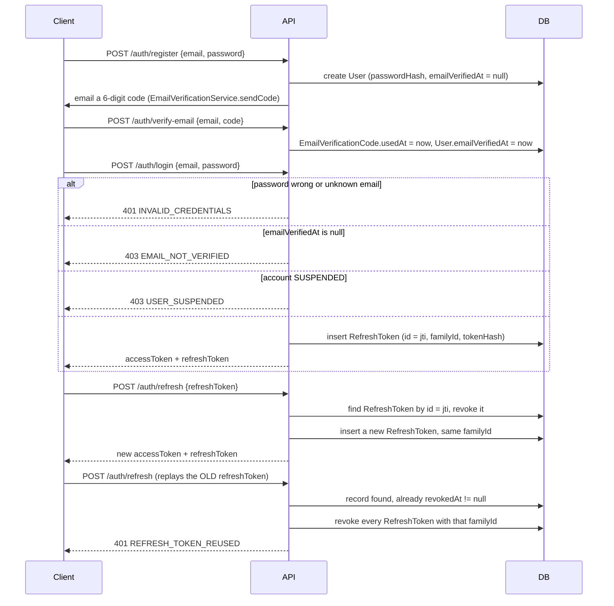

# Auth module

Every route in the API is authenticated by default; a controller opts out
per-route with `@Public()`, never the other way round, so a new endpoint
that forgets to annotate itself fails closed. The other rule that shapes
everything below: **a refresh token is single-use, and presenting one that
has already been used doesn't just fail — it revokes every token in that
token's family**, on the assumption that a reused refresh token means it
was stolen.

## Register, verify, login, refresh

## Why every route is protected by default, and what `@Public()` actually buys

`JwtAuthGuard` and `RolesGuard` are registered once, globally, as `APP_GUARD`
providers in `CommonModule` (not per-module) — no controller anywhere has to
remember to guard itself. `@Public()` doesn't mean "unauthenticated," it
means "optionally authenticated": if no bearer token is present, or the
guard's `Reflector` sees the `@Public()` metadata, the request proceeds; but
if a token *is* present and verifies, `request.user` is still populated
exactly as it would be on a protected route, and if it's present but
invalid or expired, the request proceeds anyway with `request.user` left
`undefined` rather than a 401. This is why `@CurrentUser()` works safely on
a public route (e.g. escrow's `GET /invites/:token`, described in
`../escrow/README.md`) to render something different for a logged-in vs.
anonymous caller, and why a client whose access token expired mid-session
doesn't get a hard failure on a page that never required login in the
first place.

## Why refresh tokens rotate and a reused one kills the whole family

Every successful `rotate()` call revokes the presented token's DB row and
mints a new one carrying the same `familyId`. Reuse detection follows for
free: if `rotate()` is ever called again with a token whose row is already
`revokedAt`, that's proof someone (attacker or a client with a stale token
from a race) has a copy of a token that should no longer exist, so instead
of just rejecting that one token, `TokenService.rotate()` revokes every row
sharing that `familyId` — including the one currently valid — forcing a
fresh login. A single leaked refresh token is worth at most one
undetected use.

The row's primary key (`RefreshToken.id`) *is* the JWT's own `jti`, not a
separately generated UUID — `rotate()` looks the record up in one indexed
`findOne({ where: { id: payload.jti } })` rather than a scan. The JWT's
signature alone isn't trusted as sufficient proof, though: `rotate()` also
compares a SHA-256 hash of the exact presented token string against
`tokenHash`, which was computed once at issuance. The signature check
proves the token was signed with `JWT_REFRESH_SECRET`; the hash check pins
it to the literal bytes the server actually handed out for that `jti`,
so nothing that merely carries a valid signature and a matching `jti`
claim can substitute for the real token.

## Why login checks `emailVerifiedAt` but Google login doesn't need to

`AuthService.login()` explicitly throws `EmailNotVerifiedError` when
`user.emailVerifiedAt` is null; `loginWithGoogle()` has no equivalent
check. This isn't an oversight — `GoogleTokenVerifier.verify()` already
refuses to return an identity unless the token's `email_verified` claim is
`true` (`GoogleEmailNotVerifiedError` otherwise), and Google won't set that
claim for an address it hasn't itself confirmed ownership of. A Google
identity's verified email is the same proof Mezzo's own 6-digit-code loop
is trying to establish, obtained a different way, so there's nothing left
for `loginWithGoogle()` to re-check.

## Why a Google sign-in can silently attach to an existing password account

`UsersService.linkOrCreateGoogleUser()` looks up by `googleSub` first; if
nothing matches, it falls back to matching by normalized email and, if a
password account with that email already exists, attaches `googleSub` to
it and sets `emailVerifiedAt` if it wasn't already set — no confirmation
step, no extra email. Because Google's `email_verified` claim is the same
proof Mezzo's own code-based verification is chasing (see above), this
merge doesn't weaken anything: it lets a user who registered with a
password but never got around to clicking the verification email unblock
that same account just by signing in with Google once. From then on the
account has both a `passwordHash` and a `googleSub`, and either login path
works.

## Why a fresh password-reset request invalidates the previous one first

`request()` runs `resetTokens.update({ userId }, { usedAt: now })` *before*
saving the new token row — verified directly by
`password-reset.service.spec.ts` asserting the `update` call's invocation
order precedes the `save` call's. A user who requests a second reset link
(clicked "forgot password" twice, or an old email got resurfaced from a
forwarding rule) can't have two live tokens outstanding; only the most
recently issued one can ever succeed.

## Why resetting a password revokes every refresh token for the user

`PasswordResetService.reset()` ends with
`refreshTokens.update({ userId }, { revokedAt: now })` for every
outstanding token, not just the ones that look suspicious. A password
reset is the one action a user takes specifically because they suspect
their credential is compromised, so every existing session — including
ones on devices the user didn't initiate the reset from — is logged out
as part of the same operation, not left to expire on its own schedule.

## Why the JWKS fetch is cooldown-gated and deduplicated

`GoogleTokenVerifier` caches Google's public keys by `kid` and only
refetches when a token's `kid` isn't in the cache, throttled by
`JWKS_REFETCH_COOLDOWN_MS` (60s) so a burst of logins during a genuine
Google key rotation doesn't turn into a burst of requests to Google.
Concurrent verifications that miss the cache at the same moment share one
in-flight fetch (`this.inFlight`) instead of each firing its own — proven
by the "fetches the JWKS once across concurrent verifications" test. A
still-missing `kid` after a successful refetch and an empty key set are
treated differently on purpose: empty means the fetch never produced an
authoritative answer at all (`GoogleAuthUnavailableError`, retry later);
a populated set that just doesn't contain this `kid` means Google was
reachable and this key genuinely isn't one of theirs
(`InvalidGoogleTokenError` — a token problem, not an outage).

## Why the rate limit guard fails open when Redis is down

`AuthRateLimitGuard` wraps its Redis calls in a `try/catch` that logs a
warning and returns `true` on any Redis error, rather than blocking every
login because the cache is unreachable — losing rate limiting during a
Redis outage is judged cheaper than one dependency taking down the whole
authentication surface. Unknown-email responses on `forgot-password` and
`resend-verification` follow the same asymmetry in the other direction:
both return `void` unconditionally, real account or not, so neither
endpoint can be used to enumerate registered addresses.

## Typed errors

| Error | Status | Thrown when |
| --- | --- | --- |
| `InvalidCredentialsError` | 401 | Unknown email, wrong password, or a password login attempted against a Google-only account (`passwordHash` is null) |
| `EmailNotVerifiedError` | 403 | Password login before `emailVerifiedAt` is set |
| `UserSuspendedError` | 403 | Login, Google login, or refresh rotation for a `SUSPENDED` account |
| `GoogleEmailNotVerifiedError` | 403 | Google ID token's `email_verified` claim is not `true` |
| `InvalidGoogleTokenError` | 401 | Bad signature, wrong audience/issuer, expired, wrong algorithm, or unknown `kid` (with a reachable JWKS) |
| `GoogleAuthNotConfiguredError` | 503 | `GOOGLE_AUTH_ENABLED` is false or `GOOGLE_CLIENT_ID` is unset |
| `GoogleAuthUnavailableError` | 503 | Google's JWKS endpoint is unreachable or returned a non-2xx, and the key cache is still empty |
| `InvalidRefreshTokenError` | 401 | Refresh token fails signature/expiry verification, its row is missing, its hash doesn't match, or it's past `expiresAt` |
| `RefreshTokenReusedError` | 401 | A refresh token whose row is already `revokedAt` is presented again |
| `InvalidPasswordResetTokenError` | 400 | Reset token unknown, already used, expired, or its user no longer exists |
| `InvalidVerificationCodeError` | 400 | Verification code wrong, expired, already used, max-attempts exhausted, or the email is unknown/already verified |
| `EmailAlreadyRegisteredError` | 409 | `register()` with an email already in `users` (thrown from `UsersService`, not this module) |
| `RateLimitExceededError` | 429 | Too many attempts against a guarded auth endpoint from one IP within the configured window (shared with other rate-limited modules) |

## Key pieces

- **`TokenService`** — the only code path that issues, rotates, or revokes
  `RefreshToken` rows. `issueTokenPair()` starts a new family
  (`randomUUID()`); `rotate()` and `revokeAllForUser()` are the only ways a
  row's `revokedAt` gets set.
- **`EmailVerificationService`** — one `EmailVerificationCode` row per user
  (unique index on `userId`), overwritten in place on every `sendCode()`
  rather than accumulating history; `attempts` resets to 0 on each new
  code and locks the code out (`usedAt` set without a match) once
  `EMAIL_VERIFICATION_MAX_ATTEMPTS` is hit.
- **`PasswordResetService`** — one live `PasswordResetToken` at a time per
  user by convention (enforced by the invalidate-then-issue ordering
  above, not a unique index); the emailed token and the persisted
  `tokenHash` are never the same string.
- **`GoogleTokenVerifier`** — the only thing in this module that makes an
  outbound network call. Verification order is deliberate: resolve the
  signing key for the token's `kid` first, then let `JwtService` check
  signature, `audience`, and `issuer` together in one call, so a
  correctly-signed token for the wrong client or issuer still fails.
- **`AuthRateLimitGuard`** — applied per-route (`register`, `login`,
  `google`, `forgot-password`, `reset-password`, `verify-email`,
  `resend-verification`); the Redis key is
  `ratelimit:auth:{handlerName}:{ip}`, so each endpoint keeps its own
  counter per caller rather than sharing one budget across all of them.
  `POST /auth/refresh` is deliberately not behind this guard — reuse
  detection is already its own defense, and a legitimate client refreshing
  repeatedly near token expiry shouldn't compete with brute-force
  protection.

## Invariants

- **A `SUSPENDED` account cannot obtain new tokens**, whether by password
  login, Google login, or refreshing an existing session — checked in all
  three places, not just at login.
- **A revoked refresh token can never be rotated again**, and rotating one
  member of a family revokes that exact token, never the others — the
  others are only revoked as a group when reuse is actually detected.
- **Verification codes and password reset tokens are stored only as SHA-256
  hashes.** The raw code/token exists only in the outbound email and the
  HTTP request that redeems it; a database read alone can't produce a
  usable credential.
- **`register()` never leaks whether email delivery succeeded or failed**
  to the caller — `sendCode()` runs after the user row is committed, and a
  mailer failure surfaces as a 500 rather than silently returning a
  "verify your email" response for an account that never got the code (no
  retry path exists yet if the send itself throws).
