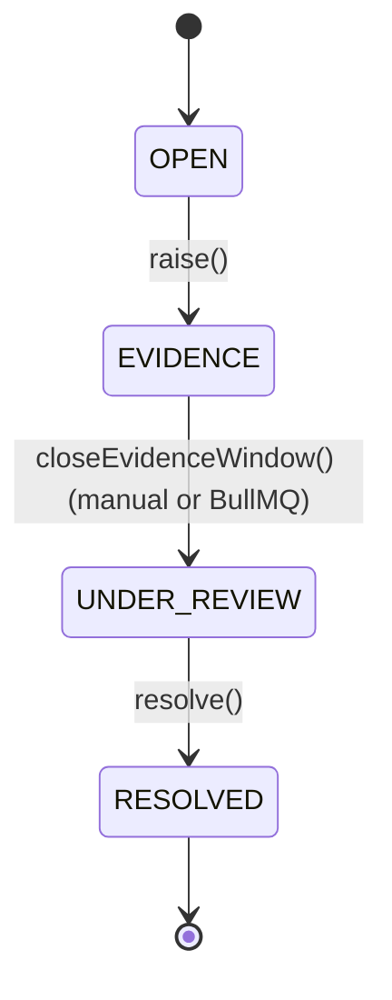

# Disputes module

The dispute lifecycle on top of the escrow state machine (Milestone 3) and
the ledger (Milestone 5/7). This module owns everything between a buyer
raising a dispute and money actually moving as a result of its resolution
— the human decision that Milestone 9's AI arbiter will later feed a
recommendation into, but never execute on its own.

## Two state machines, composed

A dispute has its own lifecycle, independent of (but composed with) the
escrow's:



`DisputeStateMachine` is a smaller mirror of `EscrowStateMachine`
(`DISPUTE_TRANSITION_TABLE`, an optimistic `version` column, an
append-only `DisputeEvent` per transition) — the same "only through the
state machine, terminal states are terminal, concurrent transitions
serialize on `UPDATE ... WHERE version =`" guarantees Milestone 3
established, applied to a second aggregate.

`raise()` drives both machines in a single DB transaction: the escrow
moves `DELIVERED -> DISPUTED` (freezing it — see below) and the new
`Dispute` row moves `OPEN -> EVIDENCE` in the same transaction the row
was inserted in. That combination is why `DisputeStateMachine.transition()`
(and, after a bug this milestone found, `EscrowStateMachine.transition()`
too) resolve their initial row lookup through the *passed* `EntityManager`
when one is given, rather than the injected repository: reading through a
different connection than the one holding the open transaction cannot see
a row that transaction inserted but hasn't committed yet, since Postgres
is read-committed by default. Every earlier caller of these state
machines only ever transitioned rows that were already committed by a
prior request, so the bug was latent until this module's `raise()`
became the first caller to create-then-transition inside one transaction.

## Freezing is free

"Raising a dispute freezes the escrow: no auto-release, no release, no
refund can execute except through dispute resolution" costs no new code.
`ESCROW_TRANSITION_TABLE[DISPUTED]` only permits `RESOLVED_RELEASE` and
`RESOLVED_REFUND` (Milestone 3/7 already reserved these). Once an escrow
is `DISPUTED`, `SettlementService.release()`/`.refund()`/`.autoRelease()`
all fail their `findTransitionRule` lookup and throw
`IllegalTransitionError` (or no-op, for the BullMQ-driven `autoRelease`)
regardless of timing — the same "absent from the table, not a race"
reasoning the Milestone 7 README already documents for dispute-vs-release.

## Evidence window

`raise()` requires the buyer to already have at least one `AT_DELIVERY`
`EvidenceItem` (uploaded via the existing `evidence` module endpoints
before calling this one) — `MissingDisputeEvidenceError` otherwise. It
then computes `evidenceWindowExpiresAt` (`DISPUTE_EVIDENCE_WINDOW_HOURS`,
default 72h) and schedules a BullMQ delayed job
(`dispute-evidence-window` queue) that closes the window automatically,
mirroring `escrow`'s `auto-release` job one-for-one:
`DisputeEvidenceWindowProcessor` just calls
`DisputeService.autoCloseEvidenceWindow()`, which swallows
`IllegalDisputeTransitionError`/`StaleDisputeVersionError` as expected
no-ops (someone — an arbiter calling `closeEvidenceWindow()` directly, or
`resolve()` itself — already moved the dispute past `EVIDENCE`). The
seller's rebuttal is not a separate endpoint: they upload `AT_DELIVERY`
evidence through the same `evidence` module endpoints the buyer used,
scoped by `uploaderId` when the `DisputePacket` is assembled.

Non-submission is never persisted as a standalone flag — `getPacket()`
computes `submissionFlags` (`buyerSubmitted`, `sellerSubmitted`,
`evidenceWindowElapsed`) live from the evidence table and
`evidenceWindowExpiresAt` every time it's read, so the signal is always
consistent with the current data rather than a snapshot that could drift.

## Resolution: one formula for all three outcomes

`RELEASE_TO_SELLER`, `REFUND_TO_BUYER`, and `SPLIT` all reduce to the same
computation — "what fraction of the held price, if any, releases to the
seller":

```
sellerShareBps = REFUND_TO_BUYER -> 0
               | RELEASE_TO_SELLER -> 10_000
               | SPLIT -> dto.splitSellerBps   (1..9_999, zod-enforced)

releasedAmount = floor(price * sellerShareBps / 10_000)
{ feeAmount, netAmount: sellerAmount } = computeFeeSplit(releasedAmount, feeBps)
buyerAmount = price - releasedAmount
```

`computeFeeSplit` is the same pure helper `SettlementService`'s happy-path
release uses (`escrow/fee-split.ts`, extracted from it this milestone) —
the platform's fee math is identical whether the escrow released normally
or through a dispute. The three ledger lines
(`seller:wallet`/`platform:fee_revenue`/`buyer:wallet`, each optional and
omitted when zero) always sum to exactly `price`, so `SPLIT` can never
leave residue in — or overdraw — the holding account by construction, not
by a follow-up check. `RELEASE_TO_SELLER` and `REFUND_TO_BUYER` are just
the `sellerShareBps = 10_000` and `= 0` edge cases of the same formula,
which is why they reproduce Milestone 7's exact `release()`/`refund()`
figures.

The escrow itself only ever lands in `RELEASED` (via `RESOLVED_RELEASE`,
for `RELEASE_TO_SELLER` and `SPLIT` — a `SPLIT` always sends a strictly
non-zero share to the seller, `splitSellerBps` being constrained to
`1..9_999`) or `REFUNDED` (via `RESOLVED_REFUND`, for `REFUND_TO_BUYER`).
No new escrow states were added: Milestone 3/7 already reserved exactly
the two intermediate states this needed.

**Resolution is idempotent** by construction, not by re-checking amounts:
`resolve()` returns the existing `Dispute` unchanged the moment
`dispute.state === RESOLVED`, before touching the escrow or the ledger. A
genuine concurrent race between two resolutions is the same optimistic
version race Milestone 7 already relies on — the loser's
`DisputeStateMachine.transition()` throws `StaleDisputeVersionError`
before either the escrow transitions or the ledger post are attempted.

## `DisputePacket`

`getPacket()` is the deterministic read model Milestone 9's AI arbiter
(and Milestone 11's human arbiter console) will read: frozen terms, a
merged and time-ordered timeline of both `EscrowEvent`s and
`DisputeEvent`s, the `AT_CREATION` bundle, the buyer's and seller's
`AT_DELIVERY` bundles kept separate (so a reader — human or model — can
tell rebuttal from original claim without inferring it), the submission
flags above, and the escrow's full `chatTranscript` (Milestone 10's
`chat` module, chronological, each message carrying its optional
evidence attachment) — the field was added to the packet's shape back in
Milestone 8 as an empty placeholder specifically so it wouldn't change
out from under Milestone 9's arbiter once Milestone 10 filled it in.
Access is a party of the escrow
or `ARBITER`/`ADMIN` — enforced in the service, not `@Roles()`, since
regular parties (plain `USER`) legitimately need to read their own
dispute's packet too.

## Key pieces

- **`dispute-transition-table.ts` / `DisputeStateMachine`** — the sole
  mutator of `Dispute.state`, mirroring `escrow`'s pair exactly.
- **`DisputeService`** — `raise`, `closeEvidenceWindow` /
  `autoCloseEvidenceWindow`, `resolve`, `getPacket`.
- **`DisputeEvidenceWindowProcessor`** — the BullMQ worker for the
  evidence-window queue, symmetric with `escrow`'s `AutoReleaseProcessor`.
- **`DisputeController`** — `POST /escrows/:escrowId/disputes` (raise,
  buyer-only, checked in the service), `GET /disputes/:id` (packet,
  party-or-arbiter), `POST /disputes/:id/close-evidence-window` and
  `POST /disputes/:id/resolve` (both `@Roles(ARBITER, ADMIN)` — the
  human-in-the-loop gate Milestone 9/11 will build the actual console
  for).
