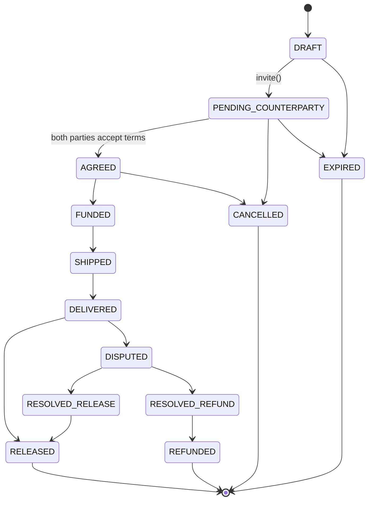

# Escrow module

The escrow aggregate and its state machine — the spine every later milestone
(evidence, ledger, funding, settlement, disputes, arbitration) builds on.

## State diagram

`RELEASED`, `REFUNDED`, `CANCELLED`, and `EXPIRED` are terminal: the
transition table gives them zero legal next states, so any transition
attempted out of one of them — including a repeat of the transition that
already landed them there — is rejected.

## What this milestone owns vs. what it doesn't

The full table above is encoded now (`escrow-transition-table.ts`) and
mechanically enforced end-to-end. Milestone 3 implements the left-hand
side of the diagram: draft creation, invite, agreement, and cancellation.
Everything from `AGREED` through `RELEASED`/`REFUNDED` is now implemented
too (Milestones 6 and 7):

| Transition | Owned by |
|---|---|
| `AGREED -> FUNDED` | Milestone 6 (`payments` module), on a verified payment webhook |
| `FUNDED -> SHIPPED` | Milestone 7 — `SettlementService.ship()` |
| `SHIPPED -> DELIVERED` | Milestone 7 — `SettlementService.confirmDelivery()` |
| `DELIVERED -> RELEASED` | Milestone 7 — `SettlementService.release()` (manual) or `.autoRelease()` (BullMQ) |
| `DELIVERED -> DISPUTED` | Milestone 7's minimal `SettlementService.dispute()` is superseded by Milestone 8's `DisputeService.raise()` (`disputes` module) — reason codes, required evidence, and the evidence window |
| `DISPUTED -> RESOLVED_RELEASE` / `RESOLVED_REFUND` | Milestone 8 — `DisputeService.resolve()` (`disputes` module); Milestone 9 will feed it an AI recommendation but never call it directly |
| `RESOLVED_RELEASE -> RELEASED` | Milestone 7 — `SettlementService.release()` (state-agnostic; legal from either `DELIVERED` or `RESOLVED_RELEASE`) |
| `RESOLVED_REFUND -> REFUNDED` | Milestone 7 — `SettlementService.refund()` |

Every one of these attaches its own party/role check at the service layer
(not in the transition table's guard system, which only knows "is *a*
party", not "is specifically the buyer") and calls
`escrowStateMachine.transition()` — never assigns `escrow.state` directly,
and never touches money outside a single DB transaction shared with the
state transition (Milestone 5's ledger rule; see `SettlementService`
below for how that composition works).

`EXPIRED` is reachable from `DRAFT` and `PENDING_COUNTERPARTY` in the table
(an escrow nobody ever agreed to), but no scheduler drives it yet.

## Settlement (Milestone 7)

`SettlementService` (`settlement.service.ts`) owns ship / confirm-delivery
/ release / dispute / refund. It lives in this module rather than a
separate "settlement" module because CLAUDE.md fixes the module list and
these are fundamentally escrow-lifecycle operations; the money side reuses
`LedgerModule` and the scheduling side reuses BullMQ via `QueueModule`.

**Inspection window.** `confirmDelivery()` sets `Escrow.deliveredAt` and
enqueues a BullMQ delayed job (`escrow-auto-release` queue, job id
`auto-release-{escrowId}`, delay = `inspectionWindowHours` in ms). BullMQ
job ids may not contain `:` — `escrowId` alone would be ambiguous across
queues but is fine within one queue's own key namespace, hence the dash.
`AutoReleaseProcessor` (a `WorkerHost`) just calls
`SettlementService.autoRelease(escrowId)` when the job fires.

**Why `release()` doesn't hard-code its source state.** The ledger posting
for a release (`DR escrow:holding -> CR seller:wallet` for `price - fee`,
`CR platform:fee_revenue` for the fee) is identical whether the escrow
arrived at `RELEASED` from `DELIVERED` (the normal path) or from
`RESOLVED_RELEASE` (a future dispute resolved in the seller's favor,
Milestone 8/11). `executeRelease()` doesn't check the *current* state
itself — it hands `RELEASED` to `EscrowStateMachine.transition()`, which
already knows from the table which source states are legal and throws
`IllegalTransitionError` for anything else. Same reasoning for `refund()`
against `REFUNDED` (legal only from `RESOLVED_REFUND`).

**Composing the ledger post and the transition atomically.** Both
`LedgerService.postTransaction()` and `EscrowStateMachine.transition()`
accept an optional trailing `EntityManager` (added in this milestone).
`executeRelease()`/`refund()` open one `dataSource.transaction()` and pass
that single manager to both calls, transition first: if the transition's
optimistic-version check fails, the ledger post never runs and nothing
rolls back partially. This is also why a losing concurrent request never
pays twice — see below.

**Concurrency.** Every one of the races the milestone calls out reduces to
the same mechanism already proven in `EscrowStateMachine`'s own
optimistic-version check (`escrow-state-machine.spec.ts` /
`escrow.e2e-spec.ts`), not to anything settlement-specific:

- *Dispute vs. auto-release, same instant:* both resolve to
  `stateMachine.transition()` reading the same `version`; the database
  lets exactly one `UPDATE ... WHERE version = :version` match. The loser
  throws `StaleEscrowVersionError`.
- *Auto-release firing after a dispute already landed:* no race needed —
  `findTransitionRule(DISPUTED, RELEASED)` is simply absent from the
  table, so it's an `IllegalTransitionError` regardless of timing.
- *`autoRelease()` never throws to its caller* (the BullMQ worker): it
  catches exactly `IllegalTransitionError` and `StaleEscrowVersionError`
  as expected no-ops — "someone else already resolved this" — and
  rethrows anything else so BullMQ's retry policy still applies to real
  failures. `dispute()` and `release()` (the buyer-facing HTTP paths) do
  **not** swallow those errors — a buyer racing and losing sees a clean
  409, which is correct: they tried to act on an escrow that had just
  moved.
- *Double release:* two concurrent `release()` calls are the *same* race
  as dispute-vs-auto-release, just with both sides calling `release()`
  instead of one calling `dispute()`.

## Payouts

Withdrawing a seller's wallet balance out to a bank account lives in the
`payments` module (`PayoutService`), not here — it's a money-out-to-a-
provider concern symmetric with funding's money-in-from-a-provider, and
CLAUDE.md doesn't name a separate payouts module either. See
`apps/api/src/payments/README.md`.

## Key pieces

- **`escrow-transition-table.ts`** — pure, DB-free. The `state -> allowed
  next states -> guard` map plus `mustBeParty`, the one guard this
  milestone owns. Fully unit-tested in isolation.
- **`EscrowStateMachine`** — the *only* code path allowed to change
  `escrow.state`. `transition()` validates against the table, runs the
  guard, then does an optimistic-locked `UPDATE ... WHERE id = :id AND
  version = :version` and an `EscrowEvent` insert in one DB transaction.
  Zero affected rows means someone else moved the escrow first, so it
  throws `StaleEscrowVersionError`. `transitionIdempotent()` wraps that:
  if the escrow already sits in the requested (terminal) state, a repeat
  call is a clean no-op instead of an error — the "idempotent at the API
  boundary, hard error at the domain boundary" rule.
- **`EscrowService`** — the business flows: `createDraft`, `invite`,
  `acceptInvite`, `previewInvite`, `acceptTerms`, `updateTerms`, `cancel`,
  `getEvents`. Everything that isn't a raw state transition lives here, on
  top of the state machine.
- **`EscrowController` / `InviteController`** — the HTTP surface for the
  above. Invites are addressed by token at a top-level `/invites/:token`
  route since the accepting user only ever has the token, not the escrow
  id.

## Reading the escrow (Frontend Milestone F3)

Two read endpoints exist purely so the shared escrow screen can render
what the state machine already recorded — neither one can move an escrow.

- **`GET /escrows/:id/events`** returns the `EscrowEvent` log in
  chronological order, party-only (`assertIsParty`). The client renders
  the state machine's actual history rather than inferring a timeline
  from the current state — an escrow in `RELEASED` has a materially
  different story depending on whether it passed through `DISPUTED`.
- **`GET /invites/:token`** is the one `@Public()` route in this module.
  An invited user has a token and nothing else — no account yet, so no
  bearer token, so no party membership to check. It returns the frozen
  terms plus the `AT_CREATION` evidence bundle (with integrity flags and
  presigned URLs) so they can see what they're agreeing to *before*
  registering. It reuses `acceptInvite`'s validity checks via the shared
  `validInviteOrThrow()` helper, so a used, expired, or moved-on token
  fails the preview with exactly the error it would fail acceptance
  with — the accept path can never be reached through a token the
  preview accepted. It deliberately exposes no user identities.

## Invariants

- **Exactly one buyer and one seller.** Enforced twice: at the
  application layer (`acceptInvite` rejects a third party or the
  initiator accepting their own invite) and at the schema layer (a unique
  index on `(escrow_id, role)` — the DB itself refuses a second `BUYER` or
  `SELLER` row for the same escrow).
- **Terms are frozen at `AGREED`.** `updateTerms` only works while
  `DRAFT` or `PENDING_COUNTERPARTY`; anything later throws
  `TermsFrozenError`.
- **Invite tokens are single-use and expiring.** A used or expired token
  can never move an escrow to `AGREED` — `acceptInvite` fails before a
  second `EscrowParty` is ever created, so the state machine's own
  `PENDING_COUNTERPARTY -> AGREED` rule is never reached via a bad token.
- **Concurrent transitions serialize.** Two simultaneous
  `transition()` calls on the same escrow race at the database, not in
  application code — exactly one `UPDATE` matches its `WHERE version =`
  clause, and the loser gets `StaleEscrowVersionError`.
