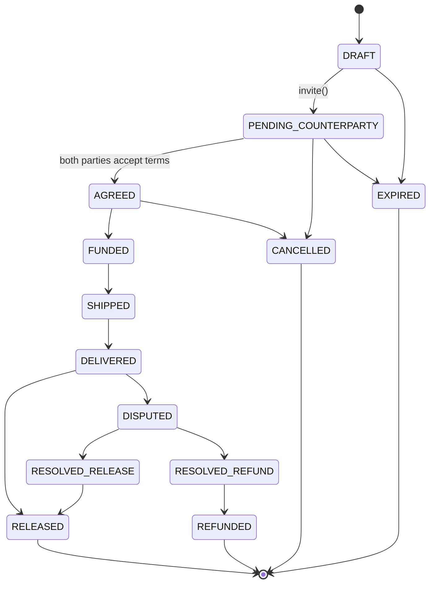

# Escrow module

The escrow aggregate and its state machine — the spine every later milestone
(evidence, ledger, funding, settlement, disputes, arbitration) builds on.

## State diagram

`RELEASED`, `REFUNDED`, `CANCELLED`, and `EXPIRED` are terminal: the
transition table gives them zero legal next states, so any transition
attempted out of one of them — including a repeat of the transition that
already landed them there — is rejected.

## What this milestone owns vs. what it doesn't

The full table above is encoded now (`escrow-transition-table.ts`) and
mechanically enforced end-to-end, but this milestone only implements the
*business logic* and HTTP surface for the left-hand side of the diagram:
draft creation, invite, agreement, and cancellation. The transitions from
`AGREED` onward (`FUNDED`, `SHIPPED`, `DELIVERED`, `RELEASED`, `DISPUTED`,
`RESOLVED_RELEASE`, `RESOLVED_REFUND`, `REFUNDED`) exist in the table and
are exercised directly against `EscrowStateMachine` in the e2e suite, but
have no guard and no HTTP endpoint yet — those belong to the modules that
will actually own that business logic:

| Transition | Owned by |
|---|---|
| `AGREED -> FUNDED` | Milestone 6 (funding), on a verified payment webhook |
| `FUNDED -> SHIPPED` | Milestone 7 (settlement) |
| `SHIPPED -> DELIVERED` | Milestone 7 (settlement) |
| `DELIVERED -> RELEASED` | Milestone 7 (settlement / auto-release) |
| `DELIVERED -> DISPUTED` | Milestone 8 (disputes) |
| `DISPUTED -> RESOLVED_RELEASE` / `RESOLVED_REFUND` | Milestone 8/9 (disputes / arbitration) |
| `RESOLVED_* -> RELEASED` / `REFUNDED` | Milestone 8 (disputes), alongside the ledger posting |

When those milestones land, they attach their own guards to the relevant
table rows and call `escrowStateMachine.transition()` — they never assign
`escrow.state` directly, and never touch money outside a single DB
transaction shared with the state transition (Milestone 5's ledger rule).

`EXPIRED` is reachable from `DRAFT` and `PENDING_COUNTERPARTY` in the table
(an escrow nobody ever agreed to), but no scheduler drives it yet — that's
a natural fit for the BullMQ patterns introduced in Milestone 7.

## Key pieces

- **`escrow-transition-table.ts`** — pure, DB-free. The `state -> allowed
  next states -> guard` map plus `mustBeParty`, the one guard this
  milestone owns. Fully unit-tested in isolation.
- **`EscrowStateMachine`** — the *only* code path allowed to change
  `escrow.state`. `transition()` validates against the table, runs the
  guard, then does an optimistic-locked `UPDATE ... WHERE id = :id AND
  version = :version` and an `EscrowEvent` insert in one DB transaction.
  Zero affected rows means someone else moved the escrow first, so it
  throws `StaleEscrowVersionError`. `transitionIdempotent()` wraps that:
  if the escrow already sits in the requested (terminal) state, a repeat
  call is a clean no-op instead of an error — the "idempotent at the API
  boundary, hard error at the domain boundary" rule.
- **`EscrowService`** — the business flows: `createDraft`, `invite`,
  `acceptInvite`, `acceptTerms`, `updateTerms`, `cancel`. Everything that
  isn't a raw state transition lives here, on top of the state machine.
- **`EscrowController` / `InviteController`** — the HTTP surface for the
  above. Invites are addressed by token at a top-level `/invites/:token`
  route since the accepting user only ever has the token, not the escrow
  id.

## Invariants

- **Exactly one buyer and one seller.** Enforced twice: at the
  application layer (`acceptInvite` rejects a third party or the
  initiator accepting their own invite) and at the schema layer (a unique
  index on `(escrow_id, role)` — the DB itself refuses a second `BUYER` or
  `SELLER` row for the same escrow).
- **Terms are frozen at `AGREED`.** `updateTerms` only works while
  `DRAFT` or `PENDING_COUNTERPARTY`; anything later throws
  `TermsFrozenError`.
- **Invite tokens are single-use and expiring.** A used or expired token
  can never move an escrow to `AGREED` — `acceptInvite` fails before a
  second `EscrowParty` is ever created, so the state machine's own
  `PENDING_COUNTERPARTY -> AGREED` rule is never reached via a bad token.
- **Concurrent transitions serialize.** Two simultaneous
  `transition()` calls on the same escrow race at the database, not in
  application code — exactly one `UPDATE` matches its `WHERE version =`
  clause, and the loser gets `StaleEscrowVersionError`.
