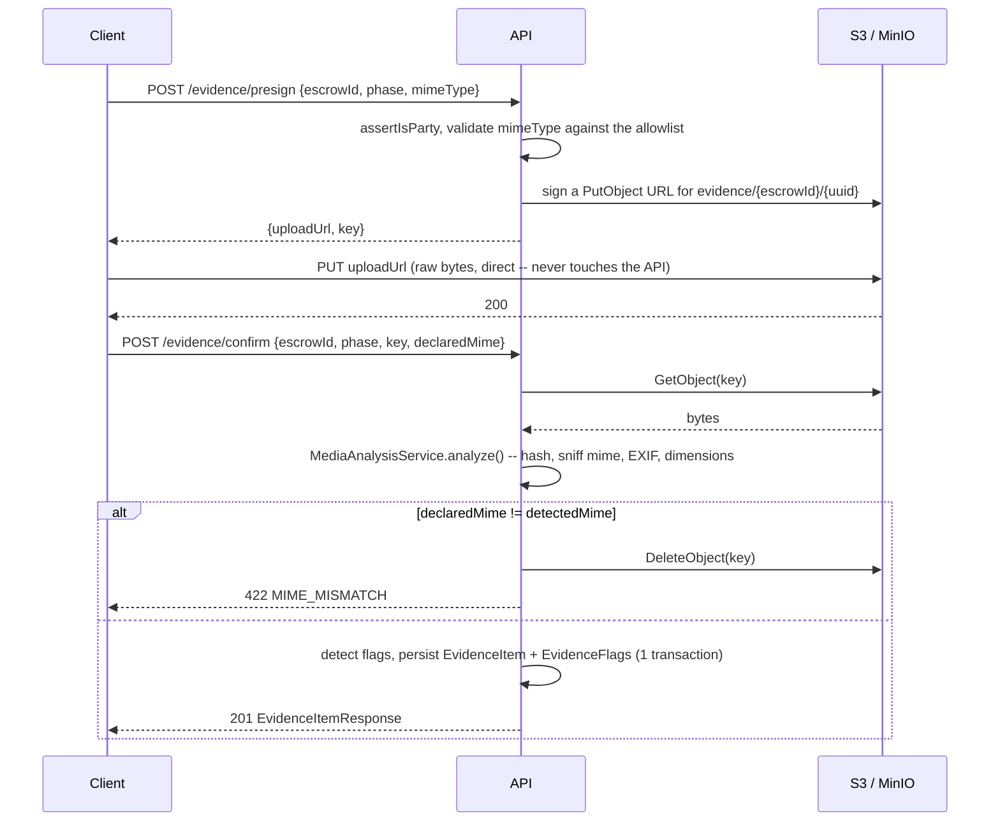

# Evidence module

Captures the product's condition and integrity-checks it. This is the source
of truth the AI arbiter (Milestone 9) reasons over — capture and integrity
only, no content classification.

## Upload flow

The client's bytes only ever cross the wire twice: browser → S3 on upload,
S3 → API on confirm. The API process never proxies the upload itself — that's
the whole point of presigned URLs, and it's why `confirm` has to reach back
out to S3 itself rather than receiving the file in the request body.

## Why there are two S3 endpoints

Because the bytes cross the wire from two different places, the API and the
browser do not necessarily reach S3 at the same address. Running everything
in Docker is the case that forces this apart: the API reaches MinIO over the
compose network at `http://minio:9000`, while the browser can only reach the
host-published `http://localhost:9000`. A presigned URL carries its host
inside the signature, so signing with the internal address produces a URL the
browser cannot resolve — and the upload fails at the one step that never
touches the API, with nothing in the API logs to show for it.

`S3_ENDPOINT` is therefore the address the *API* uses for its own calls
(`CreateBucket`, `GetObject` on confirm, `DeleteObject`), and the optional
`S3_PUBLIC_ENDPOINT` is the address presigned URLs are signed for. Leaving
`S3_PUBLIC_ENDPOINT` unset — or blank — means the two are the same, which is
the right answer everywhere the browser and the API share a view of storage.

## Why declared-vs-detected mime is a hard rejection, not a flag

The milestone prompt's prose lists "mismatched declared vs. detected mime"
as one of the four signals to *flag* for the AI layer, but the milestone's
own test case says the opposite: **"A file whose declared mime doesn't match
sniffed bytes is rejected."** The test case wins — it's the actual gate.
`MimeMismatchError` (422) is thrown, the orphaned object is deleted from
storage, and no `EvidenceItem` is ever created. The other three signals
(duplicate content, missing EXIF, stale EXIF timestamp) really are soft
flags: the upload succeeds, and the flag rides along on the response for a
human or the AI arbiter to weigh later.

## Flags

| Flag | When | Scope |
|---|---|---|
| `DUPLICATE_CONTENT` | Any prior `EvidenceItem` — in *any* escrow — shares this content hash | reverse-dedup, global |
| `MISSING_METADATA` | The mime is an image type and no EXIF data was extracted | images only; video never has EXIF, so it's never flagged for lacking it |
| `TIMESTAMP_MISMATCH` | EXIF `DateTimeOriginal`/`CreateDate` is more than `EVIDENCE_TIMESTAMP_DRIFT_HOURS` from now | requires EXIF to be present in the first place |

## Why this milestone required a change to the escrow module

The milestone's test list includes: *"Creating an escrow requires at least
one `AT_CREATION` photo before it can leave `DRAFT`."* That's an escrow
state-machine guard, but it depends on data this module owns. Rather than
teach the (deliberately DB-free) transition table how to run an async query,
`EscrowService.invite()` checks evidence existence itself, directly against
the `EvidenceItem` repository, before ever calling
`EscrowStateMachine.transition()`. `EscrowModule` registers the
`EvidenceItem` *entity* via `TypeOrmModule.forFeature()` for this — not the
whole `EvidenceModule` — so the module dependency stays one-directional
(`EvidenceModule → EscrowModule`, for `assertIsParty`) and never cycles back.

## Storage

`StorageProvider` is one interface with one implementation, `S3StorageProvider`
— unlike `KycProvider`'s Fake/real split in Milestone 2. MinIO genuinely
speaks the S3 API, so the same class runs against MinIO in dev/test and real
S3 in production; only the endpoint config differs. It ensures its bucket
exists on module init and maps a missing object to the typed
`EvidenceObjectNotFoundError`.

The provider lives in its own `StorageModule` rather than being bound
inline in `EvidenceModule`. `EscrowModule` needs presigned URLs too (for
the public invite preview) and importing `EvidenceModule` there would
cycle — `EvidenceModule` already imports `EscrowModule` for
`assertIsParty`. A leaf module holding just the `STORAGE_PROVIDER` binding
lets both import it without a cycle.

**Reads are presigned, never proxied.** `EvidenceItemResponse.url` is a
short-lived presigned GET URL (`S3_PRESIGN_EXPIRY_SECONDS`), minted per
response rather than stored. The bucket stays private and the API never
streams bytes it doesn't have to. The field is optional on the schema:
paths that return evidence as nested context (chat attachments, the
arbiter's `DisputePacket`) omit it rather than mint URLs nobody asked for.

## Immutability

There is no update or delete endpoint anywhere in `EvidenceController`. That
absence *is* the enforcement mechanism — not a guard, not a DB trigger, just
routes that were never built. A replaced photo is a new `EvidenceItem` row;
the old one is retained forever.
