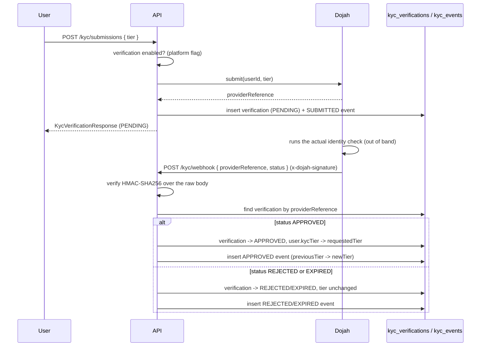

# KYC module

Identity verification and tier assignment. **A user's `kycTier` is the only
thing that gates how much money they can move** — `payments` reads it to cap
funding and to require a minimum tier for payouts, and nothing outside this
module is ever allowed to write `User.kycTier` directly.

## Provider-driven verification flow



There is no synchronous "verify now" path: a submission is always `PENDING`
until a callback resolves it. `handleProviderCallback` is also the only
place `User.kycTier` is ever written from outside an admin action, and it is
idempotent by construction — once a verification leaves `PENDING` the
handler returns the (already-resolved) row unchanged instead of re-applying
the tier change, so a replayed webhook can never move a user's tier twice or
downgrade an already-approved verification.

## The manual (document-upload) path

Not every deployment has a live provider, and even with one, a human review
lane is needed for edge cases. A user can instead:

1. `POST /kyc/documents/presign` — get a presigned upload URL under
   `kyc-documents/{userId}/{uuid}`, the same presign-then-confirm shape the
   `evidence` module uses.
2. Upload the file directly to storage, then
   `POST /kyc/documents/confirm` — the service downloads the object back and
   runs it through `MediaAnalysisService` (the same sniffer `evidence` uses)
   to get the byte-detected MIME type. A mismatch against the client's
   declared MIME deletes the object and throws
   `KycDocumentMimeMismatchError` rather than trusting the upload's
   `Content-Type` header. The document is stored with `verificationId: null`
   — a free document isn't tied to any submission yet.
3. `POST /kyc/manual-submissions { tier, documentIds }` — creates a
   `PENDING` verification with `provider: 'manual'` and, in one
   `dataSource.transaction()`, reassigns those loose documents onto it and
   writes the `SUBMITTED` event. The transaction exists so a submission can
   never end up referencing documents that didn't actually get attached.

A manual submission never resolves itself — an admin must call
`POST /admin/kyc/verifications/:id/approve` or `/reject`
(`AdminService` → `KycService.approveVerification` /
`rejectVerification`), which both reject a verification that isn't
`PENDING` with `KycVerificationNotPendingError` so a reviewed submission
can't be reviewed twice. Approval is the only place besides the webhook
handler that raises `user.kycTier`.

`overrideTier()` is a third, separate path used by `POST
/admin/kyc/users/:userId/tier` — it skips submissions and documents
entirely, writing an already-`APPROVED` verification with
`provider: 'manual'` and reference `manual-override:{uuid}`. It exists for
support cases (a user verified outside the platform, a stuck queue) and is
audited (`KYC_TIER_OVERRIDE`) exactly like every other admin action in
`AdminService`.

## Tiers and caps

```
TIER_0 < TIER_1 < TIER_2 < TIER_3
```

| Tier | Funding cap per transaction | Payout eligibility |
| --- | --- | --- |
| `TIER_0` | `0` — cannot fund anything that requires verification | Blocked (`requireTier` needs at least `TIER_1`) |
| `TIER_1` | `KYC_TIER_1_CAP_KOBO`, default 50,000,000 kobo (₦500,000) | Allowed, uncapped |
| `TIER_2` | `KYC_TIER_2_CAP_KOBO`, default 500,000,000 kobo (₦5,000,000) | Allowed, uncapped |
| `TIER_3` | Uncapped (`getCap` returns `null`) | Allowed, uncapped |

`KycCapsService.getCap()` is the single source both `payments.service.ts`
(funding) and this module read. Note the asymmetry: **funding is
tier-and-capped**, but **payouts are tier-gated only** —
`PayoutService.savePayoutAccount()`/`requestPayout()` call
`kycService.requireTier(sellerId, TIER_1)` with no amount check at all,
because the milestone that added payouts never specified a per-transaction
payout cap, only a wallet-balance check
(`InsufficientWalletBalanceError`). Adding one later means adding a call to
`assertCanFund`-equivalent logic on the payout side, not changing
`KycCapsService`.

## Two independent ways verification gets skipped

- **The platform kill switch.** `SettingsService.isVerificationEnabled()`
  reads a `PlatformFlag` row (`VERIFICATION_ENABLED`), falling back to the
  `VERIFICATION_ENABLED` env var (default `true`) when no row exists yet.
  Both `requireTier()` and `assertCanFund()` short-circuit to "allowed" the
  moment this is off — an admin can disable verification platform-wide (e.g.
  while the provider integration is being stood up) without touching a
  single escrow's terms.
- **Per-escrow exemption, with a floor.** `EscrowTerms.requiresVerification`
  is set per escrow at creation, but `payments.service.ts` ORs it with the
  price itself: `requiresVerification || price >= KYC_VERIFICATION_EXEMPT_THRESHOLD_KOBO`
  (default 10,000,000 kobo / ₦100,000). A low-value escrow can opt out of
  verification in its terms; a high-value one cannot opt out no matter what
  the terms say, because the threshold check happens outside this module
  and this module only ever sees the final boolean.

## Provider abstraction

One `KycProvider` implementation is active at a time, chosen at boot by
`KYC_PROVIDER`:

| `KYC_PROVIDER` | Implementation | Required config |
| --- | --- | --- |
| `fake` (default) | `FakeKycProvider` | none |
| `dojah` | `DojahKycProvider` | `DOJAH_BASE_URL`, `DOJAH_APP_ID`, `DOJAH_PRIVATE_KEY`, `DOJAH_WEBHOOK_SECRET` |

The env schema fails boot if `KYC_PROVIDER=dojah` is selected without all
four Dojah variables set — the same fail-fast pattern `payments` uses for
its own provider credentials. `FakeKycProvider.submit()` returns a random
`fake-{uuid}` reference and nothing else; there is no in-memory double that
fabricates a webhook callback (unlike `FakePaystackProvider`'s
`seedTransaction()`), so exercising the approve/reject path in tests and
local dev goes through the manual submission + admin review flow instead of
a simulated provider callback. The root README's tech-stack table also
names Mono as an identity provider; only Dojah has an implementation in
`providers/` — there is no `MonoKycProvider` and no `mono` value in the
`KYC_PROVIDER` enum.

## Webhook signature: narrower than payments'

`KycWebhookSignatureService.verify()` only runs its check at all when
`KYC_PROVIDER === 'dojah'` — with the `fake` provider active, `/kyc/webhook`
accepts any payload unsigned, since there's no real Dojah account to have
signed it. This is different from `payments`, where **both** webhook
endpoints are always signature-checked regardless of which provider is
active, because a payment provider can be swapped while intents funded
through the old one are still in flight; a KYC provider has no equivalent
"in-flight money" to protect, so gating the check on the active provider is
safe here in a way it wouldn't be there. The scheme itself is also
different: HMAC-**SHA256** (Dojah's `x-dojah-signature` header) versus
Paystack's HMAC-SHA512, but the shape is the same as both payment
providers' checks — compute over the raw, unparsed body
(`RawBodyRequest`/`request.rawBody`, `main.ts`'s `{ rawBody: true }`) and
compare with `timingSafeEqual`, never a `===` on the parsed JSON.

## Key pieces

- **`KycService`** — submission (both paths), the webhook handler, the two
  gate checks (`requireTier`, `assertCanFund`), document presign/confirm,
  and the admin operations (`approveVerification`, `rejectVerification`,
  `overrideTier`, `listVerifications`, `listDocuments`). Controllers for
  both `/kyc/*` and `/admin/kyc/*` are thin wrappers over this one service.
- **`KycCapsService`** — pure lookup from tier to cap `Money`, reads
  `KYC_TIER_1_CAP_KOBO` / `KYC_TIER_2_CAP_KOBO` from config. No DB access,
  fully unit-tested in isolation.
- **`KycEvent`** — an append-only audit row per tier-relevant action
  (`SUBMITTED`, `APPROVED`, `REJECTED`, `EXPIRED`), always carrying
  `previousTier` and `newTier`, mirroring `EscrowEvent`'s role in the
  `escrow` module: the current `kycTier` on `User` is a projection, this
  table is the history.
- **`KycTierGuard` / `@RequireTier(tier)`** — a declarative guard exported
  from the module for controllers that want a tier check enforced before
  the handler runs. Nothing currently applies it: `payments` calls
  `kycService.requireTier()` / `assertCanFund()` directly from
  `PaymentsService`/`PayoutService` instead, since funding also needs the
  amount-vs-cap check the guard alone can't express. It exists as
  ready-made infrastructure for a future endpoint that only needs the
  simple minimum-tier check.

## Invariants

- **`User.kycTier` changes in exactly three places**: a resolved provider
  webhook, an admin approval, and an admin override — never a direct write
  from a controller, and never as a side effect of funding or a payout.
- **A verification is reviewed at most once.** Both the webhook handler and
  the admin approve/reject endpoints refuse to act on a verification that
  isn't `PENDING` — the webhook returns the existing row unchanged, the
  admin path throws `KycVerificationNotPendingError`.
- **A document only becomes evidence for a submission it was explicitly
  attached to.** `confirmDocument` always stores `verificationId: null`;
  only `submitManual`'s transaction — never the presign/confirm calls
  themselves — sets it, and only for documents the caller owns
  (`InvalidKycDocumentKeyError` guards the storage-key prefix).
- **The declared MIME type is never trusted on its own.**
  `KycDocumentMimeMismatchError` fires, and the object is deleted, whenever
  the byte-sniffed MIME disagrees with what the client claimed.
