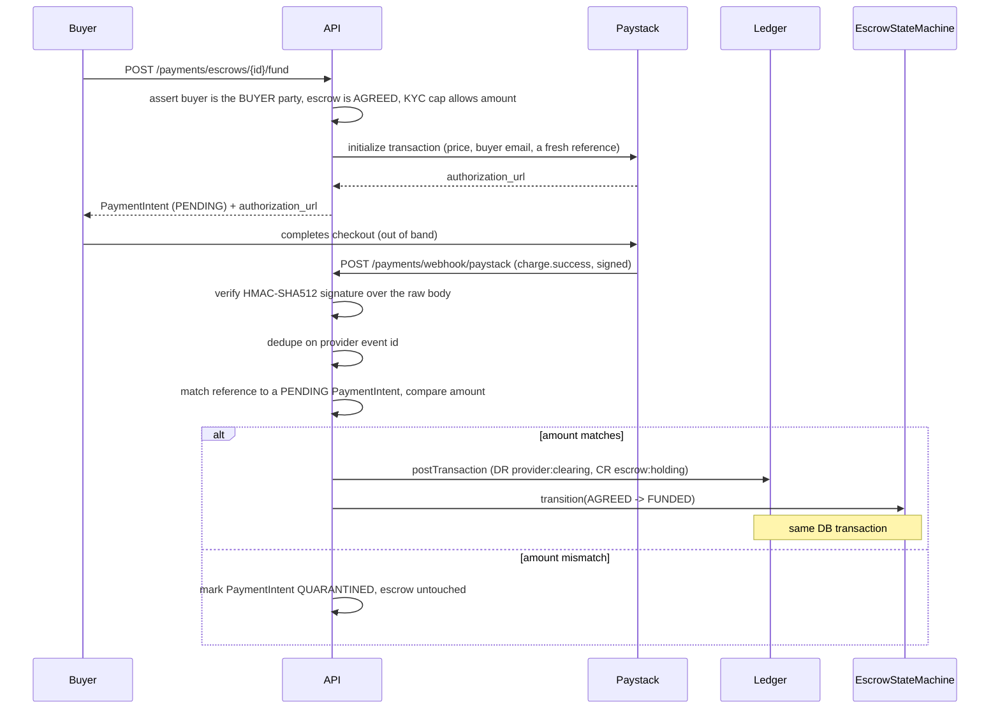

# Payments module

The buyer-funding path. The buyer can only fund an escrow that is `AGREED`,
and money only ever enters the ledger from a **verified provider webhook** —
never from a client-reported "success" callback, which is why no such
endpoint exists anywhere in this module.

## Funding flow

## Why funding amount is exactly the price, not price-plus-fee

The milestone prompt says the buyer is charged "price + buyer-side fees",
but Milestone 7's release math only works if the escrow holding account
equals `price` exactly: release posts `price - fee` to the seller and `fee`
to `platform:fee_revenue`, which only balances back to the held amount if
`price` is what was held in the first place. Introducing a separate,
undefined "buyer fee" now — with no destination account and no test
coverage — would conflict with that arithmetic for no tested benefit, so
`PaymentIntent.amount` is `EscrowTerms.priceAmount` and nothing else.

## Composing the ledger post and the state transition atomically

The prompt requires the ledger post and the `AGREED -> FUNDED` transition to
land in one DB transaction. Both `LedgerService.postTransaction()` and
`EscrowStateMachine.transition()` normally open their own transaction via
`DataSource.transaction()` — so both now accept an optional `EntityManager`
as a trailing parameter. When omitted, each behaves exactly as before
(opens its own transaction). `PaymentsService.handleWebhook()` opens one
`dataSource.transaction()` and threads that single manager through both
calls, so a failure in either one rolls back both — no state where money
moved but the escrow didn't, or vice versa.

## Two independent idempotency layers

- **Provider event id** (`PaymentWebhookEvent`, unique on `(provider,
  providerEventId)`): the first thing checked, before any interpretation of
  the payload. A replayed `charge.success` for an already-processed event id
  is a silent no-op.
- **Ledger idempotency key** (`fund:{paymentIntentId}`): a second,
  independent guarantee at the ledger layer in case the same intent is ever
  funded through two different provider events (shouldn't happen, but the
  ledger doesn't have to trust that it can't).

## Why signature verification needs `rawBody`

Paystack signs the exact bytes it sent; re-serializing the parsed JSON body
and hashing that can disagree with the original bytes (key ordering,
whitespace, number formatting). `main.ts` creates the Nest app with
`{ rawBody: true }` so Express retains the original `Buffer` on
`request.rawBody` alongside the normal parsed `body` — `WebhookSignatureService`
hashes that buffer, never the reconstructed object.

## Provider abstraction

`PaymentProvider` mirrors the `KycProvider` split from Milestone 2. One
implementation is active at a time, chosen at boot by `PAYMENT_PROVIDER`:

| `PAYMENT_PROVIDER` | Implementation | Required config |
| --- | --- | --- |
| `fake` (default) | `FakePaystackProvider` | `PAYSTACK_SECRET_KEY` |
| `paystack` | `PaystackHttpProvider` | `PAYSTACK_SECRET_KEY` |
| `flutterwave` | `FlutterwaveHttpProvider` | `FLUTTERWAVE_SECRET_KEY`, `FLUTTERWAVE_SECRET_HASH` |

The env schema fails the boot if the selected provider's credentials are
missing, so a half-configured gateway can never serve a funding request.
`FakePaystackProvider` is an in-memory double for local dev and tests; it
speaks Paystack's shapes, which is why it reports `name: 'paystack'` and why
`fake` needs the Paystack secret (the webhook signature check uses it).
`FakePaystackProvider.seedTransaction()` is test-only surface for
`PaymentsReconciliationService` scenarios — it does not fabricate a
transaction on `initializeTransaction()`, since initializing a checkout
doesn't mean it succeeded.

### The checkout redirect target is per-transaction, not a dashboard default

Both providers redirect the buyer's browser back to a URL after checkout —
Paystack's `callback_url`, Flutterwave's `redirect_url` — passed on the
`initializeTransaction` request itself, built from `WEB_APP_URL` and
`input.escrowId` (`${WEB_APP_URL}/escrow/{escrowId}/fund`, the page
`useEscrowFunding` polls for the intent to resolve). This is required, not
cosmetic: leaving it unset falls back to whatever static default is
configured in the provider's own dashboard, which has no way to know which
escrow the buyer was funding — pointing that default at the API's webhook
path (an easy mistake, since it's the only Mezzo URL configured there)
sends the buyer's browser to a POST-only backend route and a 404 the moment
they finish paying, even though the webhook itself (a separate, correctly
configured server-to-server call) still lands and funds the escrow.

### Routing Flutterwave calls through a static-IP proxy

Flutterwave's live `/transfers` (and related) endpoints require the
caller's IP to be on an account-level whitelist, and that whitelist only
accepts single fixed addresses — not CIDR ranges. Hosts without a static
outbound IP (e.g. Render's free tier, whose outbound traffic comes from a
shared, unpredictable pool) can never satisfy that from the platform side.
`FlutterwaveHttpProvider` uses `undici`'s own `fetch` (not the Node global
one — the two aren't interchangeable across `dispatcher`, since Node's
global `fetch` is backed by its own internal, differently-versioned copy
of undici) so every request can carry a `dispatcher`. When
`FLUTTERWAVE_PROXY_URL` is set, requests route through an `undici.ProxyAgent`
pointed at that URL — a static-IP proxy service (or a self-hosted one) —
so Flutterwave sees the proxy's fixed IP instead of the host's. Left unset,
`dispatcher` is `undefined` and requests go out directly, unchanged from
before.

### Why both webhook endpoints stay mounted

`/payments/webhook/paystack` and `/payments/webhook/flutterwave` are always
routed, regardless of which provider is active, because switching providers
does not retire the intents already in flight with the old one. Each endpoint
verifies with its own scheme — Paystack an HMAC-SHA512 over the raw body,
Flutterwave a constant-time compare of the `verif-hash` header against
`FLUTTERWAVE_SECRET_HASH` — then normalizes into one
`PaymentWebhookEventInput` (`webhook-event.ts`) that the rest of the pipeline
consumes. The clearing account a funding posts against comes from
`PaymentIntent.provider` (and a payout reversal from `Payout.provider`), never
from whichever provider happens to be active now, so money always settles
against the gateway that actually took it. The currency comes from the same
row for the same reason — clearing and wallet accounts are identified per
currency (`provider:paystack:clearing:NGN`), so a payout can never be drawn
out of a balance denominated in something else. See the `ledger` README for
why the currency is part of the account's identity rather than a property of
it.

Flutterwave quotes amounts in **major** units where Paystack quotes minor
ones. The normalizer converts via `majorToMinorUnits()`, which parses the
decimal string rather than multiplying a float, and yields `null` when it
cannot parse the amount exactly — an unverifiable amount quarantines the
intent instead of funding on a guess.

## Reconciliation

`PaymentsReconciliationService.reconcile({ from, to })` pulls the provider's
transactions for a window and cross-references them against `PaymentIntent`s
by reference: a successful provider transaction with no matching intent is
an `orphanProviderReferences` entry; a `FUNDED` intent with no matching
successful provider transaction is an `unmatchedFundedIntentIds` entry. It
has no HTTP surface yet — like the ledger's own `ReconciliationService`, it's
meant to run as a scheduled (repeatable) BullMQ job; the queue
infrastructure exists as of Milestone 7 (`QueueModule`), but nothing
schedules this one on a cron yet.

## Payouts (Milestone 7)

`PayoutService` is the money-out side, symmetric with funding's money-in:
a verified seller withdraws from `user:{id}:wallet` to a bank account via
a Paystack transfer.

- **The debit happens at request time, not on confirmation.**
  `requestPayout()` posts `DR user:wallet -> CR provider:paystack:clearing`
  immediately (inside the same transaction as creating the `Payout` row),
  removing the balance from the seller's *available* wallet right away so
  two payout requests can't both spend the same money while the transfer
  is in flight. The `transfer.success` webhook only flips `Payout.status`
  to `CONFIRMED` — no further posting, because the money already moved.
  `transfer.failed` (or `.reversed`) posts the exact reverse (`DR clearing
  -> CR wallet`) as a compensating entry and marks the payout `FAILED` —
  never an in-place edit, per the ledger's own append-only rule.
- **Idempotency is the caller's `idempotencyKey`, not a generated one.**
  Unlike funding (where the API generates the Paystack reference),
  `requestPayout()` takes a client-supplied `idempotencyKey` and looks up
  an existing `Payout` by it before ever calling Paystack again — a
  network retry on the *client* side (button double-click, a timed-out
  request that actually succeeded) replays the same key and gets back the
  original payout instead of a second transfer.
- **Same webhook endpoint as funding.** Both gateways post `charge.*` and
  `transfer.*` events to one configured URL in real life, so a provider's
  webhook endpoint stays the single entry point for both;
  `PaymentsService.processWebhook()` branches on the normalized event `kind`
  and delegates transfers to `PayoutService.handleTransferWebhook()` after
  the same signature-verification and provider-event-id dedupe every other
  webhook goes through.
- **KYC-gated, not capped.** `requireTier(sellerId, TIER_1)` mirrors
  funding's minimum tier; unlike funding there's no per-tier amount cap
  here (the milestone doesn't specify one for payouts), only the wallet
  balance check (`InsufficientWalletBalanceError`).

## Saved, provider-verified payout accounts

A seller adds a payout account once (`PUT /payouts/account`) instead of
retyping bank details on every withdrawal. `bankCode` must come from
`GET /payouts/banks` (the provider's own bank list) — `SavePayoutAccount`
rejects any code that isn't in that list (`UnknownBankError`) rather than
trusting a client-typed code the gateway would reject later at transfer
time. The account holder name is never taken from client input either: it
is always resolved from the provider (`resolveAccount`, backed by
Flutterwave's `/accounts/resolve` or Paystack's `/bank/resolve`) and that
resolved name is what gets stored as `PayoutAccount.accountName` — so
"verifying the account" means confirming the bank itself recognizes the
number, not just checking the field isn't empty. `POST
/payouts/verify-account` exposes the same resolution as a preview so the
frontend can show the resolved name before the seller commits to saving it.

`requestPayout()` re-resolves the saved account against the provider again,
immediately before transferring, and compares the freshly resolved name to
the one stored at save time (whitespace/case-insensitive). A mismatch
throws `PayoutAccountVerificationMismatchError` and blocks the transfer
rather than sending money to an account that no longer resolves to the name
the seller verified — accounts can be reassigned or renamed at the bank
between saving and withdrawing, and re-checking is cheap compared to a
misdirected payout. `PayoutAccountNotConfiguredError` covers the simpler
case: no saved account at all.

## Read surface for the money screens (Frontend Milestone F4)

Three read-only endpoints exist purely so the web client can render the
money surfaces. They compute, never mutate.

- `GET /wallet` — the three balances, each carrying its own currency and
  deliberately never collapsed into one number:
  - `available` — the derived balance of `user:{id}:wallet`.
  - `pending` — the sum of the user's `PENDING` payouts. This is money
    already debited from the wallet and sitting in provider clearing
    until the transfer webhook confirms, so it is genuinely neither
    available nor held.
  - `heldInEscrow` — the summed holding balances of every escrow the user
    is a party to. Settled escrows contribute zero, so no state filter is
    needed.
- `GET /wallet/activity` — recent money movement in human terms. It is a
  union of two sources, because no single one tells the whole story: the
  ledger entries on the user's own wallet account (release, refund,
  dispute settlement, payout, payout reversal — the kind is read off the
  posting's idempotency key prefix) plus the user's `FUNDED` payment
  intents, since funding an escrow debits the provider and credits the
  escrow holding account and so never touches the buyer's wallet account
  at all.
- `GET /payments/escrows/{id}/intent` — the latest payment intent for an
  escrow, party-gated. The funding screen polls this to distinguish
  "checkout not started" from "waiting on the webhook" from "quarantined",
  none of which are visible in the escrow state alone.

`WalletService` lives in this module rather than in `ledger` because two
of the three balances come from `Payout` and `PaymentIntent`, which this
module owns; it reads ledger balances only through `LedgerService`'s
public API. `PLATFORM_CURRENCY` is `NGN`: the wallet reports one currency
at a time, and there is no second-currency product surface yet.

## Provider float reconciliation

`ProviderFloatService` answers one question: does the money Paystack and
Flutterwave say they are holding match what our ledger says they hold?
The ledger already tracks the answer's left-hand side — every verified
funding debits `provider:{name}:clearing` and every payout credits it, so
that account's derived balance *is* our claim on the provider. Nothing
compared it to the provider's own number, which is where a silently
failed transfer or an out-of-band refund would first show up.

It is deliberately separate from `PaymentsReconciliationService`, which
matches individual transactions to intents. That catches a missing row;
this catches a wrong total, and the two fail independently.

The service reaches for `PaystackHttpProvider` and `FlutterwaveHttpProvider`
directly rather than through the injected `PAYMENT_PROVIDER` token. That
token resolves to exactly one provider, but float outlives the switch: a
balance stranded at the provider we migrated away from is precisely the
balance worth watching, and it would be invisible through the token.

A provider is only called when its secret key is set, so switching
`PAYMENT_PROVIDER` never turns the other one's row into an error — it
reports `UNCONFIGURED` and still shows the clearing balance, which is the
number that matters when no live figure is available. Under
`PAYMENT_PROVIDER=fake` no live HTTP call is made at all; the paystack row
reads `FakePaystackProvider`, so local and e2e runs exercise the reporting
path without touching a real API.

Drift is reported as a `SURPLUS`/`SHORTFALL` status plus a non-negative
`Money`, never a signed integer. `Money` refuses negative amounts by
construction, and a bare signed number in a JSON body is exactly the kind
of value that gets read with the wrong sign convention on the other side.

Provider failures degrade rather than propagate: an unreachable provider
yields `UNAVAILABLE` for that row alone, because one provider being down
is not a reason to withhold the other's balance from an admin.
