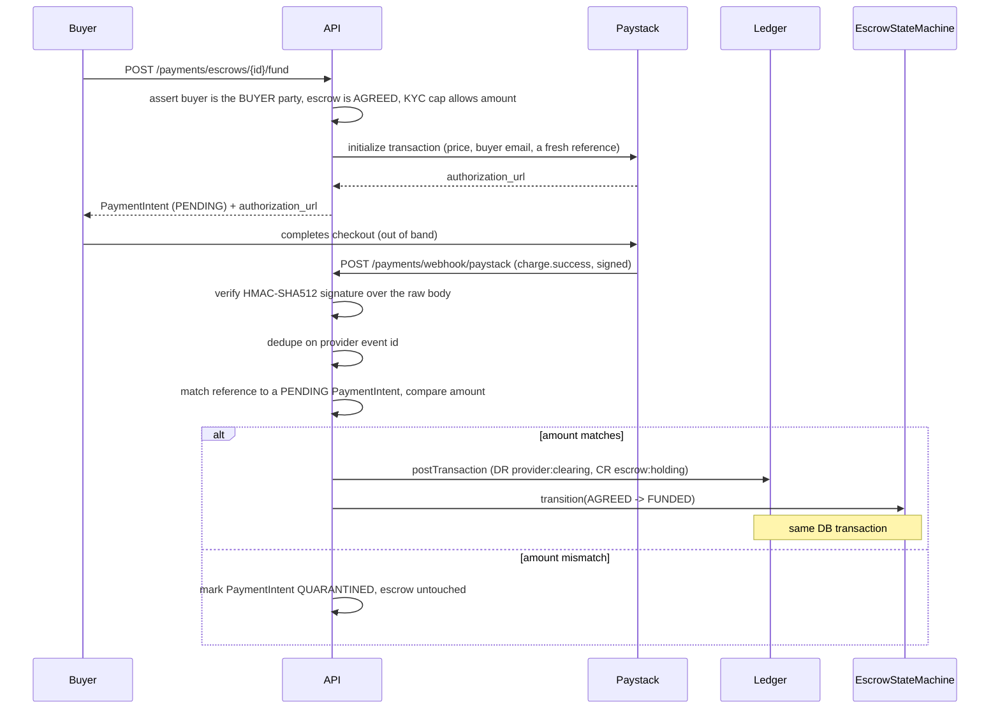

# Payments module

The buyer-funding path. The buyer can only fund an escrow that is `AGREED`,
and money only ever enters the ledger from a **verified provider webhook** —
never from a client-reported "success" callback, which is why no such
endpoint exists anywhere in this module.

## Funding flow

## Why funding amount is exactly the price, not price-plus-fee

The milestone prompt says the buyer is charged "price + buyer-side fees",
but Milestone 7's release math only works if the escrow holding account
equals `price` exactly: release posts `price - fee` to the seller and `fee`
to `platform:fee_revenue`, which only balances back to the held amount if
`price` is what was held in the first place. Introducing a separate,
undefined "buyer fee" now — with no destination account and no test
coverage — would conflict with that arithmetic for no tested benefit, so
`PaymentIntent.amount` is `EscrowTerms.priceAmount` and nothing else.

## Composing the ledger post and the state transition atomically

The prompt requires the ledger post and the `AGREED -> FUNDED` transition to
land in one DB transaction. Both `LedgerService.postTransaction()` and
`EscrowStateMachine.transition()` normally open their own transaction via
`DataSource.transaction()` — so both now accept an optional `EntityManager`
as a trailing parameter. When omitted, each behaves exactly as before
(opens its own transaction). `PaymentsService.handleWebhook()` opens one
`dataSource.transaction()` and threads that single manager through both
calls, so a failure in either one rolls back both — no state where money
moved but the escrow didn't, or vice versa.

## Two independent idempotency layers

- **Provider event id** (`PaymentWebhookEvent`, unique on `(provider,
  providerEventId)`): the first thing checked, before any interpretation of
  the payload. A replayed `charge.success` for an already-processed event id
  is a silent no-op.
- **Ledger idempotency key** (`fund:{paymentIntentId}`): a second,
  independent guarantee at the ledger layer in case the same intent is ever
  funded through two different provider events (shouldn't happen, but the
  ledger doesn't have to trust that it can't).

## Why signature verification needs `rawBody`

Paystack signs the exact bytes it sent; re-serializing the parsed JSON body
and hashing that can disagree with the original bytes (key ordering,
whitespace, number formatting). `main.ts` creates the Nest app with
`{ rawBody: true }` so Express retains the original `Buffer` on
`request.rawBody` alongside the normal parsed `body` — `WebhookSignatureService`
hashes that buffer, never the reconstructed object.

## Provider abstraction

`PaystackProvider` mirrors the `KycProvider` split from Milestone 2:
`PaystackHttpProvider` calls the real Paystack REST API, `FakePaystackProvider`
is an in-memory double selected via `PAYSTACK_PROVIDER=fake` for local dev and
tests. `FakePaystackProvider.seedTransaction()` is test-only surface for
`PaymentsReconciliationService` scenarios — it does not fabricate a
transaction on `initializeTransaction()`, since initializing a checkout
doesn't mean it succeeded.

## Reconciliation

`PaymentsReconciliationService.reconcile({ from, to })` pulls the provider's
transactions for a window and cross-references them against `PaymentIntent`s
by reference: a successful provider transaction with no matching intent is
an `orphanProviderReferences` entry; a `FUNDED` intent with no matching
successful provider transaction is an `unmatchedFundedIntentIds` entry. It
has no HTTP surface yet — like the ledger's own `ReconciliationService`, it's
meant to run as a scheduled (repeatable) BullMQ job; the queue
infrastructure exists as of Milestone 7 (`QueueModule`), but nothing
schedules this one on a cron yet.

## Payouts (Milestone 7)

`PayoutService` is the money-out side, symmetric with funding's money-in:
a verified seller withdraws from `user:{id}:wallet` to a bank account via
a Paystack transfer.

- **The debit happens at request time, not on confirmation.**
  `requestPayout()` posts `DR user:wallet -> CR provider:paystack:clearing`
  immediately (inside the same transaction as creating the `Payout` row),
  removing the balance from the seller's *available* wallet right away so
  two payout requests can't both spend the same money while the transfer
  is in flight. The `transfer.success` webhook only flips `Payout.status`
  to `CONFIRMED` — no further posting, because the money already moved.
  `transfer.failed` (or `.reversed`) posts the exact reverse (`DR clearing
  -> CR wallet`) as a compensating entry and marks the payout `FAILED` —
  never an in-place edit, per the ledger's own append-only rule.
- **Idempotency is the caller's `idempotencyKey`, not a generated one.**
  Unlike funding (where the API generates the Paystack reference),
  `requestPayout()` takes a client-supplied `idempotencyKey` and looks up
  an existing `Payout` by it before ever calling Paystack again — a
  network retry on the *client* side (button double-click, a timed-out
  request that actually succeeded) replays the same key and gets back the
  original payout instead of a second transfer.
- **Same webhook endpoint as funding.** Paystack posts both `charge.*` and
  `transfer.*` events to one configured URL in real life, so
  `PaymentsController`'s `/payments/webhook/paystack` stays the single
  entry point; `PaymentsService.handleWebhook()` branches on the `event`
  prefix and delegates `transfer.*` to `PayoutService.handleTransferWebhook()`
  after the same signature-verification and provider-event-id dedupe every
  other webhook goes through.
- **KYC-gated, not capped.** `requireTier(sellerId, TIER_1)` mirrors
  funding's minimum tier; unlike funding there's no per-tier amount cap
  here (the milestone doesn't specify one for payouts), only the wallet
  balance check (`InsufficientWalletBalanceError`).
